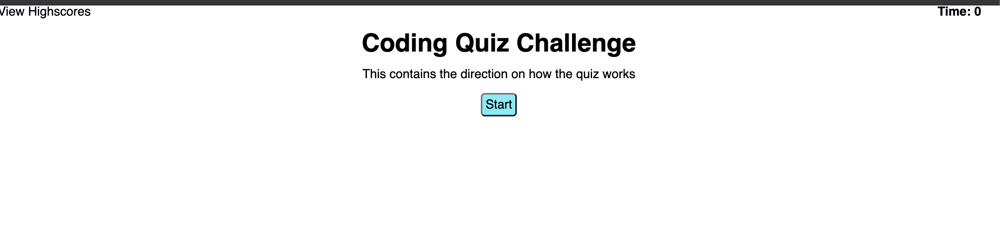

# javascript-coding-quiz
# Description 
This is a JS quiz that that asks 5 questions that displays in a random order. It is a timed quiz with a 15 second penalty for wrong answers, your quiz score is based on time remaining. 

# Usage 
brush up on JS knowledge and challenge your friends.


Usage
```md

```